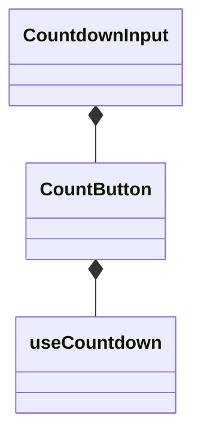
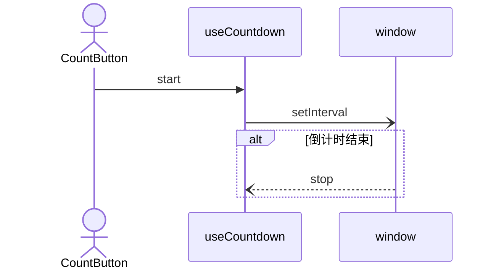

# CountDown

## 组合关系

```mermaid
classDiagram
  CountdownInput *-- CountButton
  CountButton *-- useCountdown
```

## 倒计时

```mermaid
sequenceDiagram
  Actor CountButton
  participant useCountdown
  participant window
  CountButton->>useCountdown: start
  useCountdown-)window: setInterval
  alt 倒计时结束
    window--)useCountdown: stop
  end
```
