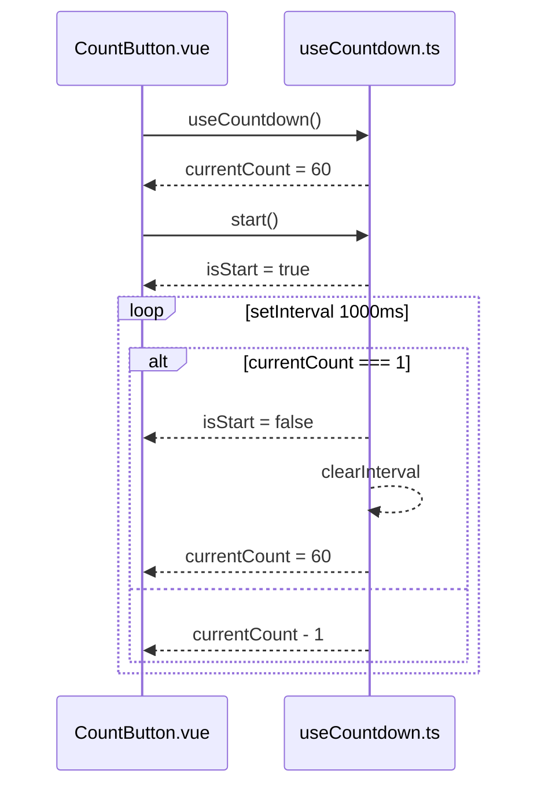

```mermaid
sequenceDiagram
  participant A as CountButton.vue
  participant B as useCountdown.ts
  A->>B: useCountdown()
  B-->>A: currentCount = 60
  A->>B: start()
  B-->>A: isStart = true
  loop setInterval 1000ms
    alt currentCount === 1
      B-->>A: isStart = false
      B-->>B: clearInterval
      B-->>A: currentCount = 60
    else
      B-->>A: currentCount - 1
    end
  end
```
