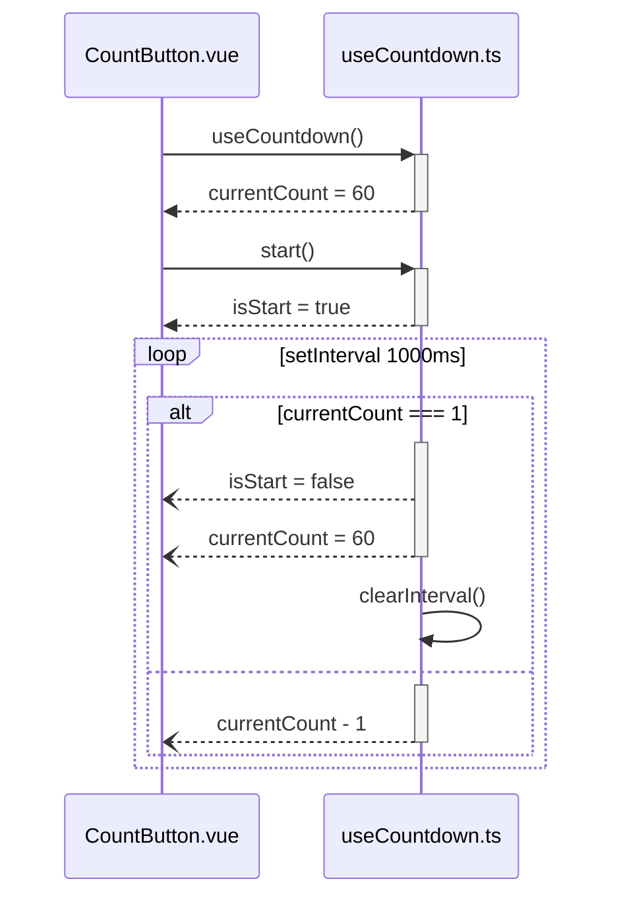

```mermaid
sequenceDiagram
  participant A as CountButton.vue
  participant B as useCountdown.ts
  A->>+B: useCountdown()
  B-->>-A: currentCount = 60
  A->>+B: start()
  B-->>-A: isStart = true
  loop setInterval 1000ms
    alt currentCount === 1
      activate B
      B--)A: isStart = false
      B--)A: currentCount = 60
      deactivate B
      B->>B: clearInterval()
    else
      activate B
      B--)A: currentCount - 1
      deactivate B
    end
  end
```
