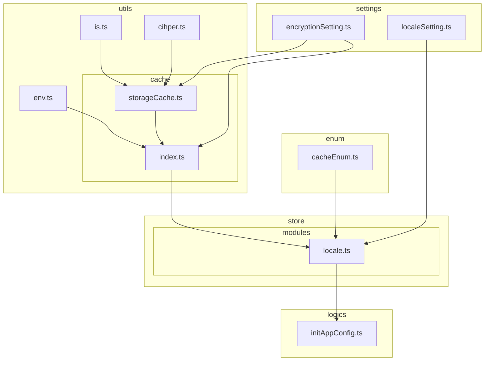

```mermaid
flowchart TB
  is --> storageCache
  cihper --> storageCache
  env --> cacheIndex
  storageCache --> cacheIndex
  cacheIndex --> locale
  encryptionSetting --> storageCache
  encryptionSetting --> cacheIndex
  locale --> initAppConfig
  cacheEnum --> locale
  localeSetting --> locale
  subgraph utils
    direction TB
    is[is.ts]
    cihper[cihper.ts]
    env[env.ts]
    subgraph cache
    direction TB
    storageCache[storageCache.ts]
    cacheIndex[index.ts]
    end
  end
  subgraph settings
    encryptionSetting[encryptionSetting.ts]
    localeSetting[localeSetting.ts]
  end
  subgraph logics
    initAppConfig[initAppConfig.ts]
  end
  subgraph store
    subgraph modules
      locale[locale.ts]
    end
  end
  subgraph enum
    cacheEnum[cacheEnum.ts]
  end
```
